# ソフトウェア工学 (Software Engineering) 
# 第01回-a: 復習 (Review)　飯島 正
  * (C) 2020, 2021 IIJIMA, Tadashi (iijima-lab)
  * SoftEng-01-a-review.ipynb

<!--
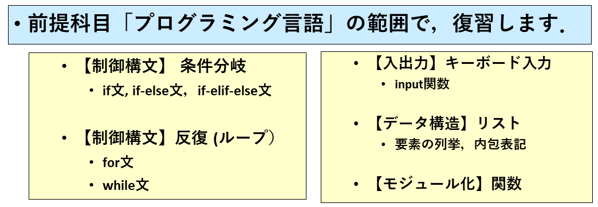
-->


### 目次

  * ソフトウェア工学-(Software-Engineering)
    * 第01回-a: 復習 (Review)

      * [0] <a href="#[0]-はじめに"> はじめに </a>
      * [1] <a href="#[1]-復習:-制御構造(Control_Structure)"> 復習: 制御構造(Control_Structure) </a>
        * [1-a] <a href="#[1-a]-条件分岐-(if文)"> 条件分岐 (if文) </a>
        * [1-b] <a href="#[1-b]-反復/ループ-(for文)"> 反復/ループ (for文) </a>
        * [1-c] <a href="#[1-c]-反復/ループ-(while文)"> 反復/ループ (while文) </a>
      * [2] <a href="#[2]-復習:-入出力-(I/O;-input/output)-→-パターン-06"> 復習: 入出力 (I/O; input/output) → パターン-06 </a>
        * [2-a] <a href="#[2-a]-input関数"> input関数 </a>
      * [3] <a href="#[3]-復習:-データ構造-(data-structure)-/-コンテナ(container)"> 復習: データ構造 (data structure) / コンテナ(container) </a>
        * [3-a] <a href="#[3-a]-リストの要素の列挙-(list_enumeration)→-パターン-07"> リストの要素の列挙 (list_enumeration)→ パターン-07 </a>
        * [3-b] <a href="#[3-b]-リストの内包表記-(list_comprehension)→-パターン-08"> リストの内包表記 (list_comprehension)→ パターン-08 </a>
    * [4] <a href="#[4]-復習:-関数-(function)→-パターン-09/10"> 復習: 関数 (function)→ パターン-09/10 </a>
    * <a href="#[5]-まとめ"> [5] まとめ </a>
        * <a href="#[5-a]-復習の内容"> 復習の内容 </a>
        * <a href="#[5-b]-例題一覧"> 例題一覧 </a>
        * <a href="#[5-c]-練習問題一覧"> 練習問題一覧 </a>

### [0] はじめに
(<a href="#目次"> 目次に戻る </a>)

##### 履修者情報 (<span style="color: red; ">ダウンロードした各履修者ご自身が書き込んでください</span>)

  * <span style="color: red; ">通し番号</span>:   (未定: 履修申告が一通り完了してから,お知らせします)
  * <span style="color: red; ">学籍番号</span>:   (書き込んでください)
  * <span style="color: red; ">氏名(漢字)</span>: (書き込んでください) 
  * <span style="color: red; ">氏名(ローマ字)</span>: 

#### このipynbファイルの使い方

  * (1) 上のセルに，<span style="color: red; ">履修者情報</span>を書き込んで，各自，保存して下さい
    * <span style="color: red; ">通し番号</span>は，未だ決まっていないので，現時点では，仮に 000 としておいて下さい
    * <span style="color: red; ">学籍番号</span>を，半角文字で書き込んでください
    * <span style="color: red; ">氏名(漢字)</span>を，漢字で書き込んでください(姓名の間に空白を挟まずに連結して下さい)
    * <span style="color: red; ">氏名(ローマ字)</span>を，半角大文字で書き込んでください．(姓名の間にハイフンを挟んで，姓→名の順に連結して下さい)
  * (2) <span style="color: red; ">ファイル名</span>を，通し番号，学籍番号と氏名(ローマ字)を含むように変更してください
    * <span style="color: red; ">01-a-{通し番号}-{学籍番号}-{氏名(ローマ字)}.ipynb</span>としてください
      * 例えば，通し番号が001，学籍番号が9999999，氏名(ローマ字)がIIJIMA-TADASHIなら，
      * <span style="color: red; ">01-a-001-9999999-IIJIMA-TADASHI.ipynb</span>
    * (3) <span style="color: red; ">練習問題の計算セル</span>に解答を書き込んで実行してください
  * (4) <span style="color: red; ">即日提出課題(Quiz-wsd:within-same-day)</span>として提出して下さい
    * 図版(fig)フォルダは共通なので提出の必要はありません，<span style="color: red; ">ipynbファイルのみ</span>提出してください
      * こちらでは，figフォルダを置いてあるフォルダに，履修者の皆さんのipynbファイルを置いて，内容確認します
    * ※ 次回までに提出していただく<span style="color: red; ">課題(Quiz-wow:within-one-week)</span>は別途出題します

#### このipynbファイルの狙い (1): オンライン授業環境の観点から

  * <span style="color: red; ">オンライン授業</span>が増えているので...
    * 配布される資料や，履修者の皆さんが作成するファイルが大量になってきています
      * プレゼンテーションPDF
      * プレゼンテーション動画
      * 例題プログラムのソースファイル
      * 練習問題のソースファイル
      * 課題のソースファイル
    * となると，<span style="color: red; ">PCの画面がごちゃごちゃ</span>になってきますね
      * 流石に，スマートフォンで実習をする人はいないと思いますが，
      * それでも<span style="color: red; ">画面が小さいノートPC</span>を使っている人もいますよね
        * <span style="color: red; ">ipynb</span>なら，1画面に収まるか，せいぜい2画面程度の<span style="color: red; ">セル(計算セル，マークダウンセル)</span>に分割できます
        * 外付けディスプレイを増設しないと中々，縦長画面も使えませんしね
    * そこで，できるだけ1ファイルで授業を進められるようにしたかった，というのが狙いの一つです

#### このipynbファイルの狙い (2): プログラミング教育の観点から

  * <span style="color: red; ">プログラミング教育</span>の観点から
    * <span style="color: red; ">例題</span>のプログラムを実際に動かして，動作を確認することは，きわめて重要です
      * でも，そのたびに，エディタを起動して，例題プログラムをタイピングして，保存して，実行するという作業は，ちょっと大変です．
        * 一度，億劫に感じると，試さないで，やりすごしてしまう習慣が定着してしまうかもしれません．
        * もっとも<span style="color: red; ">統合開発環境IDE(Integrated Development Environment)</span>を使えば，これらのデメリットは感じないでしょう
    * <span style="color: red; ">練習問題</span>も，解説のすぐ下くらいに計算セルがあると，解説を参照しながら，実行して試しやすいですよね

#### このipynbファイルの狙い (3): プログラミング環境の観点から-(a)

* <span style="color: red; ">プログラミング環境</span>の観点から-(a)
    * オンライン授業開始当時，以前，前提科目のプログラミング言語で<span style="color: red; ">Google Colab</span>の利用を奨めたのは，実は私なのですが...
      * その結果，自分のPCにプログラミング環境を整備しない人が出てきています
        * 元々，こうした実習の授業は，<span style="color: red; ">ITCのワークステーション室</span>を使っていたのですが
          * 皆さんのお手元のPCのOSは，最近だとwindows:mac:linux=2:1:0くらいの比率でバラついています
          * そのため，使える環境も多岐にわたっていて，環境設定も煩雑になりがちです
          
    * そんなこともあり，<span style="color: red; ">ipynbファイルを前提に，むしろ，プレゼンテーションの内容をipynbファイルにもりこんでしまう</span>ことを計画しました

#### このipynbファイルの狙い (3): プログラミング環境の観点から-(b)

  * プログラミング環境の観点から-(b)
    * でも，正直言って，<span style="color: red; ">自前のPCに，Pythonのプログラミング環境を整備する方がお奨め</span>です
      * 卒論・修論などで，いつまでも，ipynbファイルに収まるプログラムで進めていくのは，難しくなってきます
        * どっちにしろ，1～2画面程度の計算セルに収まる程度の関数では，できることが限られてきます
        * プロジェクトによっては，プログラムを複数のファイルに分割しないと管理しきれないということも起こってくるでしょう
      * お奨めの開発環境(言語処理系と統合開発環境)は，以下で...

#### [言語処理系] お奨めの開発環境

  * お奨めの開発環境は...
    * <span style="color: red; ">言語処理系</span>
      * <span style="color: red; ">Anaconda</span>
        * データサイエンスや科学技術計算関連のモジュールを最初からたくさん同梱している，お手軽なディストリビューションです
        * <span style="color: red; ">Jupyter NotebookやJupyterLab</span>も使えますから，ネットワークにつながなくても，自分のPCで，ipynbファイルを編集したり実行したりできます
        * そのかわり，インストールに時間がかかったり，必要なディスク容量が大きめです
          * 実際には，人によっては使わないパッケージ（モジュール)もインストールされてしまいます
          * 同梱されるPythonの言語処理系は，後述のPSF配布の版よりも，少し古い版であることが多いでしょう
      * <span style="color: red; ">Miniconda</span>
        * Anacondaが，便利な代わりに肥大化してしまっているので，
        * 最小限のパッケージ（モジュール)に限定して配布しているものです
      * <span style="color: red; ">PSFのPython</span>
        * PSF(Python Software Foundation; パイソン・ソフトウェア財団)
        * 言語処理系の公式的な参照実装である，Python(CPython)は，ここから，提供されます
          * なので， <span style="color: red; ">常に最新版がダウンロードできます</span>

#### [統合開発環境(IDE)] お奨めの開発環境

  * <span style="color: red; ">統合開発環境 (IDE: Integrated Development Environment)</span>
    * <span style="color: red; ">VS Code</span>
      * 動作が軽快で，豊富な拡張機能で，機能を拡張できます
      * 実は，<span style="color: red; ">VSコードのエディタの中で，Jupyter Notebookも使えます</span>
      * 現時点で，一押しです
    * <span style="color: red; ">IDLE</span>
      * Pythonに同梱されていて，すぐに使えます
      * シンプルですし，授業の例題や小さな課題の開発には十分です
        * ただ，プログラムのファイルサイズや複数ファイルで構成されるプロジェクトに取り組むには，ちょっと力不足を感じるかもしれません．
        * ですが，実のところ，興味深いことに，とても優秀なプログラマの中には，むしろサポート機能が貧弱なエディタを好んで使う人もいます
          * 私は，1ファイルで完結するプロジェクト(授業や研究室の教育的な側面の強い輪講の時など)では，画面が広く取れるので，よく使います
              
    * その他のIDE
      * IDEは，開発が活発かどうかが使いやすさの向上に大きく影響するので，流行り廃りの影響を受けやすいところがあります
      * ここ10年くらいのPythonを前提としたIDEの流行/人気の変遷は...
        * もちろん，使う人の好みや経験，用途によるので，一概には言えませんが，
          * 私は以下のように感じています (異論がある人も多いとおもいますが）
            * (アンケートでもよいので何らかのデータがあると良いのですが)
            * Spyder → Submarine Text → Atom → VS Code
              * Spyder以外は，汎用エディタですが，Python向けの拡張機能があり，支援機能は十分です
              * Spyderは，R(言語)を使っていた人が，Rstudioに似ているから馴染みがあったようです
                * 私は，Matlabに似ているという印象でしたが
              * かなり大きな画面のPCを使っている人以外は使いにくいかもしれませんね
              * 変数インスペクタ/変数エクスプローラーの機能は，VS codeなどでも拡張機能で導入できます(データビューアー)

### 履修にあたって

  * 今回は，一応，前提科目の範囲で，(Python言語での入門的なプログラミングを)復習します
    * 前提科目が未履修であっても...
      * もちろん，範囲の内容(入門レベルのスキルセット)を既に理解しているのであれば，この授業を履修していただいて，支障なく参加できるかと思います
        * きっと，この授業で取り上げる範囲(初級レベルのスキルセット)も独学や，中学高校などでの部活動，オンラインコースで勉強している人も，いますよね...
        * でも，「とりあえず，こう書いておけば，使えるよ」といった実戦的な知識は持っていても，「なぜ，このように書けば，使えるのか」が曖昧になってしまうこともよくあります．
          * そういうものは，しばしば<span style="color: red; ">「おまじない」と呼ばれます
            * ですが，最初っから厳密なことに拘ると先に進まなくなってしまうので，それは，決して悪いことではありません．
            * でも，<span style="color: red; ">プログラミングは，ロジックではあっても，マジックではありません． 
          * その辺りを，少しずつ，解消して，補っていければ...ということも目的のうちです
      * とはいっても
        * 現時点で，前提科目を履修していなかったり，その範囲の内容に関して，ちょっと自信がなくても...
          * まずは，今回の「復習」内容が理解できそう
          * (少なくともヒントがあれば)実習に取り組めそう，ということなら，何とかなると思います

### この科目の目的

* この科目は，「プログラミング言語」の知識を身に着けることを目的としているというよりも...
    * <span style="color: red; ">研究室に配属されてから，卒業研究や修論研究等を進めるうえで，使えるソフトウェア開発のスキルを身に着ける</span>ことを目的としています．
      * そのため...
        * ソフトウェアを開発するにあたり，どういうことから取り掛かって，どんな観点でアプローチをしていくととよさそうか?
        * 「やりたい」と思っていることを，プログラムに落とし込むためには，どういう考え方をするとよさそうか?
        * 仮に今，流行りの<span style="color: red; ">AI技術(機械学習技術)</span>や<span style="color: red; ">データサイエンス技術</span>などを試しに使ってみるだけなら...
          * 既に優れた<span style="color: red; ">フレームワーク</span>が作られていて，
            * 自分で作らなくても使えるものも多くありますし，
            * 使い方に関しての丁寧な解説もたくさんありますが...
          * でも，本格的に取り組むなら，どうしても自分で作らなくてはならない部分は，残ります．
            * 当然ですが，自分の工夫や発想を組み入れるには，自分で作らねばなりません
          * フレームワークで使うためのデータのハンドリングや，結果の可視化も自分の目的に合わせて，プログラミングできなければならない要素です．
          

### 「ソフトウェア工学」と「プログラミング・スキル」

  * <span style="color: red; ">「ソフトウェア工学」</span>と<span style="color: red; ">「プログラミング・スキル」</span>
    * 本来，「ソフトウェア工学」</span>という分野では，より一般的で幅広く，より規模の大きい「ソフトウェア開発」に関連する技術を取り扱っています
      * <span style="color: red; ">要求(Requirements)の分析</span>，<span style="color: red; ">ソフトウェアとしての設計</span>，<span style="color: red; ">モデリング</span>，<span style="color: red; ">検証</span>，<span style="color: red; ">テスティング</span>などに関して，多くの知見が蓄積されています．
      * ですが，それらを理解するためには，半期の前提科目の範囲のプログラミング知識とスキルでは少々不足していて，理解し活用することは，少し荷が重いものとなります
      * そこで，抽象的な理論や，方法論よりも，更にプログラミングのスキルをつけながら，そうした「ソフトウェア工学」の知見のごく一端だけでも触れていただくことを目的とします．

----
### [1] 復習: 制御構造(Control_Structure)
(<a href="#目次"> 目次に戻る </a>)

  * <span style="color: red; ">構造化プログラミング (structured programming)</span>
    * <span style="color: red; ">手続き的(procedural)プログラミング</span>と呼ばれる，一般によく使われているタイプのプログラミング言語では...
      * <span style="color: red; ">(ブロック中の文の)逐次実行〈連接〉, 〈条件分岐〉，〈反復/ループ〉</span>といった<span style="color: red; ">制御構文</span>をもとに，構造的にプログラミングを記述するものが多くあります
    * プログラムの構造が明解で，<span style="color: red; ">トップダウン</span>に扱うことができるため，比較的，
      * <span style="color: red; ">読みやすく(理解しやすく）</span>，<span style="color: red; ">書きやすい</span>ものとなりえます

----
### [1-a] 条件分岐 (if文)
(<a href="#目次"> 目次に戻る </a>)

#### → 参考リンク: if文

  * チュートリアル: [if文](https://docs.python.org/ja/3/tutorial/controlflow.html#if-statements)
  * ドキュメント: [if文](https://docs.python.org/ja/3/reference/compound_stmts.html#the-if-statement)

### Ex_01: if分岐 (if_selection) → パターン-01

  * <span style="color: red; ">〈条件式〉</span>を評価して<span style="color: red; ">〈真〉(True)のとき</span>だけ，
    * 〈if-ブロック〉を実行する
  * 評価結果が<span style="color: red; ">〈偽〉(False)のとき</span>は，
    * 何もしない
  

<!--
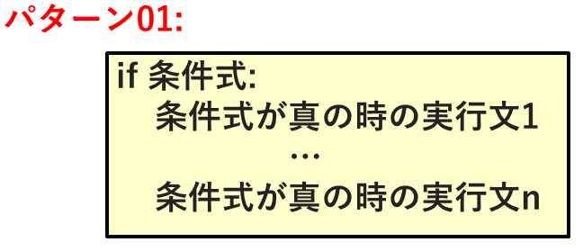
-->


<!--
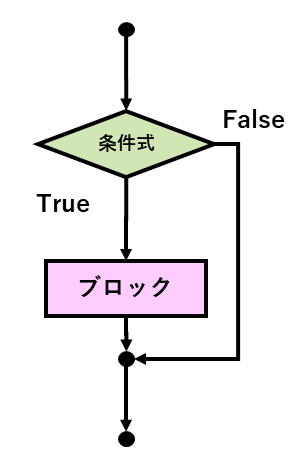
-->


  * ブロック</span>は，字下げ(indentation)</span>で範囲を指定する
    * 字下げは，空白文字(半角空白かTab)
      * 半角空白4文字を推奨</span>
        * 間違えて，全角空白が混入すると発見しにくいので注意
      * Tab文字を1つというのもありだが...あまり推奨しない
        * 1回押せば字下げできるので速く打てるが，Tabの表示幅はアプリケーションの設定によって異なるので，意外と不便
        * エディタの支援機能で，前の行に基づいて自動字下げするエディタも多いので，このメリットは小さい
        * インデントの仕方は統一する
          * 半角空白列と，Tab文字の両方を混在させてはいけない
          * この混在も，発見しにくいので注意

  * <span style="color: red; ">代入</span>
    * =は，代入．右辺の数式の評価結果を，左辺の変数に代入する
  * <span style="color: red; ">比較演算子</span>
    * <は，大小比較
      * 他の大小比較としては，<, <=, >, >=
    * <span style="color: red; ">等号</span>は==, <span style="color: red; ">不等号</span>は!=
  * <span style="color: red; ">\# 以降</span>は，<span style="color: red; ">コメント(注釈)</span>であり，実行されない

#### 例題(Example)-01: [if文]  整数の大小比較

  * 変数xと変数yに代入された整数の大小比較
    * xがyより小さいときには，
      * その旨を表示してください 
    * さもなくば
      * 何もしない


```python
# ===== [例題-01: if文] 変数xと変数yに代入された整数の大小比較 =====
#   * xがyより小さいときには，その旨を表示してください 

x = 3
y = 5
if x < y:
    print( "xはyより小さい" )
```

----
### Ex_02: if_else分岐 (if_else_selection) → パターン-02`

  * <span style="color: red; ">〈条件式〉</span>を評価して<span style="color: red; ">〈真〉(True)のとき</span>は，
    * 〈if-ブロック〉を実行する
  * 評価結果が<span style="color: red; ">〈偽〉(False)のとき</span>は，
    * 〈else-ブロック〉(ブロック2)を実行する

<!--
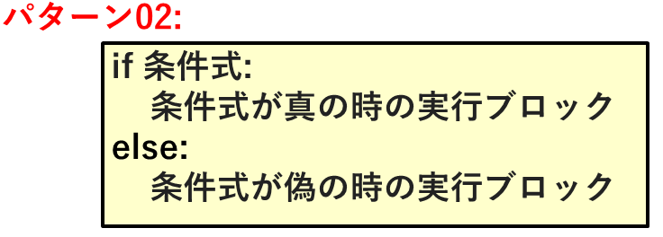
-->


<!--
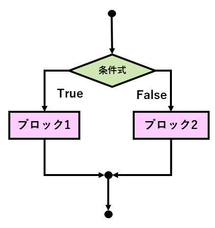
-->


  * <span style="color: red; ">%</span>は<span style="color: red; ">剰余演算子</span>
    * a % bは，aをbで割った余り
      * 2で割った余りがゼロ(2で割り切れる)なら，偶数 

#### 例題(Example)-02: [if-else文] 変数xに代入した整数の偶奇判定

  * xに3を代入してから，xの値の偶奇判定結果を表示する
    * 2で割った余りがゼロ(2で割り切れる)なら，偶数


```python
# ===== [例題-02: for文] 変数xに代入した整数の偶奇判定 =====
# * xに3を代入してから，xの値の偶奇判定結果を表示する
#   * 2で割った余りがゼロ(2で割り切れる)なら，偶数
    
x = 3

if x % 2 == 0:
    print( "xは偶数" )
else:
    print( "xは奇数" )
```

#### 練習問題(Practice)-01: [if-else文] 3の倍数判定

 * (1) xという変数に，好きな100未満の正の整数を代入してください
 * (2) その変数が，3の倍数なら"fizz"，さもなくば，その整数をそのまま，表示してください


```python
# ===== [練習問題-01: if-else文] 3の倍数判定 =====
#  * (1) xという変数に，好きな100未満の正の整数を代入してください
#  * (2)その変数が，3の倍数なら"fizz"，さもなくば，その整数をそのまま，表示してください

# ----- (1) -----
x = 33
# ----- (2) -----
if ★★★穴埋め★★★:
    print( "fizz" )
else:
    print( x )
```

----
### Ex_03: if_elif_else分岐 (if_elif_else_selection) → パターン-03

  * <span style="color: red; ">〈条件式-1〉</span>を評価して<span style="color: red; ">〈真〉(True)のとき</span>は，
    * 〈ブロック-1〉を実行する
  * <span style="color: red; ">さもなくば</span>，
    * <span style="color: red; ">〈条件式-2〉</span>を評価して<span style="color: red; ">〈真〉(True)のとき</span>は，
      * 〈ブロック-2〉を実行する
    * <span style="color: red; ">さもなくば</span>，
      * <span style="color: red; ">〈条件式-3〉</span>を評価して<span style="color: red; ">〈真〉(True)のとき</span>は，
        * 〈ブロック-3〉を実行する
      * <span style="color: red; ">さもなくば</span>，
        * 〈ブロック-4〉を実行する

<!--
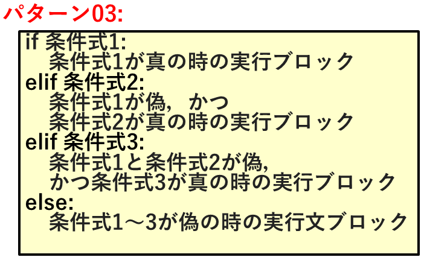
-->


<!--
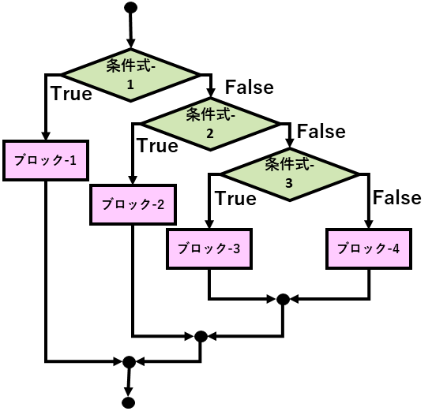
-->


#### 例題(Example)-03: [if-elif-else文] 現在(プログラム実行時)の時刻に適した挨拶を表示する

  * (1) 現在(プログラム実行時)の時刻を整数で取得します
    * datetimeモジュールを使用します
      * import 文でモジュールの使用宣言をした後，
      * datetime.datetime.now().hourで現在時刻が取得できます
      * 今のところ，「おまじない」になってしまっているかもしれませんが
        * 追々，詳細を解説していきますので，理解していきましょう
      
  * (2) 現在の時刻を表示します
    * f文字列(書式付き文字列)
      * 文字列の開始引用符の前にfを付けます
        * 文字列中の中括弧内に指定した変数を，その値を展開できます
    　  * 少し，古めの解説などでは，文字列の書式設定には，書式演算子(%)やformat()メソッドを使っていますが，
          * 今では，このf文字列を使った方が読みやすく書きやすいでしょう
          * ちなみに，f文字列のfはformat(書式)に由来します

  * (3) 時刻に適した挨拶を表示します
    * 午前3時以前と午後6時以降: こんばんは
    * 午前4時～午前5時: おはようございます．お早いですね
    * 午前6時～午前9時: おはようございます
    * 午前10時～午後5時: こんにちは


```python
# ===== [例題-03: if-elif-else文] 

# ----- (1) 現在(プログラム実行時)の時刻を整数で取得します -----
#  * datetimeモジュールを使用します
#    * import 文でモジュールの使用宣言をした後，
#    * datetime.datetime.now().hourで現在時刻が取得できます
import datetime
hour_now = datetime.datetime.now().hour

# ----- (2) 現在の時刻を表示します -----
#  * f文字列(書式付き文字列)では，
#    * 中括弧内に指定した変数の値を展開できます
print( f"今の時刻は，{hour_now}時です．" )

# ----- (3) 時刻に適した挨拶を表示します -----
#  * 時刻に適した挨拶
#    * 午前3時以前と午後6時以降: こんばんは
#    * 午前4時～午前5時: おはようございます．お早いですね
#    * 午前6時～午前9時: おはようございます
#    * 午前10時～午後5時: こんにちは

if hour_now <= 3 or hour_now > 17:
    print( "こんばんは" )
elif hour_now <= 5:
    print( "おはようございます", "お早いですね" )
elif hour_now <= 9:
    print( "おはようございます" )
elif hour_now <= 17:
    print( "こんにちは" )
```

#### 練習問題(Practice)-02: [if-elif-else文] fizz/buzz判定

  * (1) xという変数に，好きな100未満の正の整数を代入してください
  * (2) その変数が，3の倍数なら"fizz"，5の倍数なら"buzz"，その両方を満たすなら"fizzbuzz"，いずれでもなければ，その整数をそのまま，表示してください
  * note:
    * 2つの条件式の論理積は，二項演算子andで表現します
      * 「『3の倍数』かつ『5の倍数』」の「かつ」ですね
      * これは，3と5の最小公倍数15を使って，『15の倍数』として表現できます（し，そうした方が若干計算が速くなるときたいできますが）が，
        * あえて，論理積(and)を使ってみてください


```python
# ===== [練習問題-01: if-elif-else文] fizz/buzz判定 =====
#  * (1) xという変数に，好きな100未満の正の整数を代入してください
#  * (2) その変数が，3の倍数なら"fizz"，5の倍数なら"buzz"，その両方を満たすなら"fizzbuzz"，いずれでもなければ，その整数をそのまま，表示してください
#  * note:
#    * 2つの条件式の論理積は，二項演算子andで表現します

# ----- (1) -----
x = 30
# ----- (2) -----
if ★★★穴埋め★★★:
    print( "fizzbuzz" )
elif ★★★穴埋め★★★:
    print( "fizz" )
elif ★★★穴埋め★★★:
    print( "buzz" )
else:
    print( x )
```

----
### [1-b] 反復/ループ (for文)
(<a href="#目次"> 目次に戻る </a>)

#### → 参考リンク: for文

  * チュートリアル: [for文](https://docs.python.org/ja/3/tutorial/controlflow.html#for-statements)
  * ドキュメント: [for文](https://docs.python.org/ja/3/tutorial/controlflow.html#for-statements)

### Ex_04: forループ (for_loop) → パターン-04

<!--
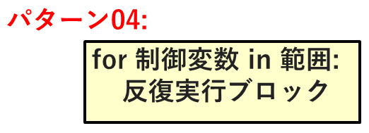
-->


  * <span style="color: red; ">for文</span>
    * <span style="color: red; ">〈範囲〉</span>の要素を，順に<span style="color: red; ">〈制御変数〉</span>に代入しながら，<span style="color: red; ">〈ブロック〉</span>を反復実行する

  * よく使われる〈範囲〉の指定方法-1
    * <span style="color: red; ">range()関数</span>
      * <span style="color: red; ">range( stop )</span>
        * 0から始めて，パラメータstopの「手前」までの範囲
          * stopの値を含まないことに注意
          * (例) range( 10 ) : 0～9までの範囲(10回繰り返す)
      * <span style="color: red; ">range( start, stop )</span>
        * startから始めて，パラメータstopの「手前」までの範囲
          * つまり，startを省略するとゼロとなる
          * (例) range( 3, 10 ) : 3～9までの範囲
      * <span style="color: red; ">range( start, stop, step )</span>
        * stepずつ，制御変数の値が変化する
          * つまり，stepを省略すると1となるが，1以外を指定することができる
            * (例) range( 3, 10, 2 ) : 3, 5, 7, 9
          * stepに負の値を指定することもできる
            * (例) range( 10, 3, -2 ) : 10, 8, 6, 4

<!--
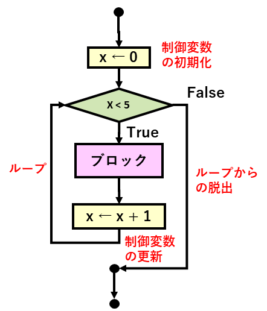
-->


#### 例題(Example)-04: [for文]  0～4までの偶数

  * やりたいこと
    * 0～4までの整数で，偶数のものだけを表示する
  * フィルタのような挙動をさせるパターンです
    * ループの中で
      * 制御変数が特定の条件を満たすときだけ，
        * 何らかのアクションを実施します
    


```python
# ===== [例題-04: for文]  0～4までの偶数 =====
#  * 0～4までの整数で，偶数のものだけを表示する 

for x in range( 5 ):
    if x % 2 == 0:
        print( x )
```

#### 練習問題(Practice)-02: [for文] 0～10までの3の倍数

  * やりたいこと
    * 0～10までの整数で，3の倍数だけを表示する
  * 上限値以外は，基本的には，上の例題と同じだが，
    * よりシンプルに，stepを3にしたrange()関数を使って，3つおきに表示させください


```python
# ===== [練習問題-02: for文] 0～10までの3の倍数 =====
#  * 0～10までの整数で，3の倍数のものだけを表示する 
#    * シンプルに，stepを3にしたrange()関数を使って，3つおきに表示させください

for x in ★★★穴埋め★★★:
    print( x )
```

### Ex_05: forループ (for_loop)

<!--
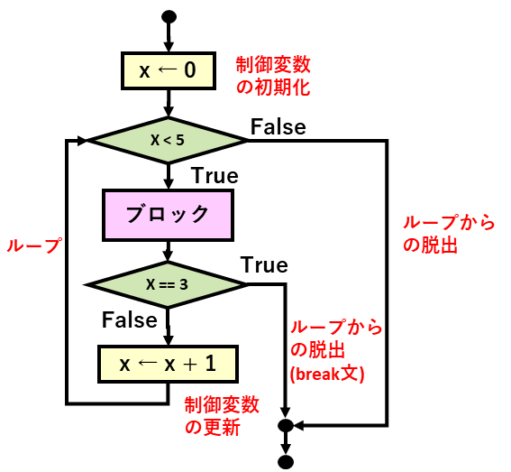
-->


  * <span style="color: red; ">break文</span>は，ループ(forループも後述のwhileループも)を脱出させる制御構文である
    * 多重のループであっても，実行するbreak文を囲む一番内側のループだけを抜ける
    * 通常，if文と組み合わせて，何らかの条件が成立した場合脱出させる
      * ループ中の異常検出なども典型的であるが，必ずしも異常時だけに使うわけではない
     * for文にelse-節をつけると，breakせずにループを完了したときのみ実行される，〈elseブロック〉を書くこともできる 
       * いずれ，例題を通して，初級スキルセットとして導入するかもしれませんが，入門スキルセットとしては扱いません(ので現時点で知識になくて支障ありません)

#### 例題(Example)-05: [for文/break文]  0～4までループする中で，3が出現したら中断する

  * そもそもが，0～3までループさせることと等価だが...
    * あえてbreak文でループを中断させる
    * 3は表示する


```python
# ===== [例題-05: for文/break文] 0～4までループする中で，3が出現したら中断する =====
#  * あえてbreak文でループを中断させる

for x in range( 5 ):
    print( x )
    if x == 3:
        break
```

  * <span style="color: red; ">continue文</span>
    * break文と同様に，if文と組み合わせて，ある条件が成立したときだけ，ループ実行を制御する構文，continue文がある
    * ループを抜けるのではなく，その回の〈反復実行ブロック〉の残りの実行を飛ばして，次の周回に入るように，ループを継続する制御文
       * if-else構文でも同等のことができるので，ここでは省略します

### Ex_06: forループ (for_loop)

<!--
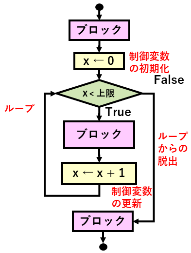
-->
forループでの〈範囲〉の指定方法-2</span>
    * <span style="color: red; ">文字列</span>や，<span style="color: red; ">リスト(後述)</span>のように，<span style="color: red; ">〈列〉(シーケンス)</span>を〈範囲〉指定に使うと...
      * その〈列〉(シーケンス)の要素を順に，<span style="color: red; ">制御変数</span>に代入しながら，ループする

<!--
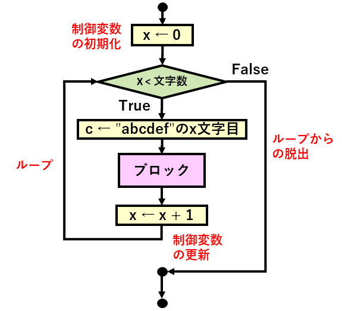
-->


<!--
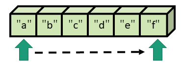
-->


  * 〈文字列〉を構成する〈文字〉を文字列として順に表示する
    * <span style="color: red; ">〈添え字(index)〉
      * 〈文字列〉では，0で始まる添え字(index)で指定することで，その位置の文字に文字列としてアクセスすることができる
      * (例) "abcdef"[3] → "d"
    * <span style="color: red; ">〈スライス〉
      * 部分範囲を指定する〈スライス〉で，部分文字列を取得することもできる
        * [start:stop:step]
      * (例) "abcdef"[1:4] → "bcd"
      * (例) "abcdef"[1:4:2] → "bd"


```python
print( "abcdef"[1:4]  )
print( "abcdef"[1:4:2] )
```

#### 例題(Example)-08: [for文]  文字列中の各文字を，順に一行ずつ表示する

  * 文字列は，繰り返し可能オブジェクト(iterable)なので，for文での反復実行の制御に使うことができる


```python
# ===== [例題-08: for文] 文字列中の各文字を，順に一行ずつ表示する =====
# * 文字列は，繰り返し可能オブジェクト(iterable)なので，
#   * for文での反復実行の制御に使うことができる

for c in "abcdef":
    print( c )
```

#### 練習問題(Practice)-04: [for文] 文字列中の数字の総和(左から数字以外の文字が出るまで)

  * 与えられた文字列の中に，数字以外の文字が出現するまで
    * 左端から1文字ずつ順に数字を，1桁の数値に変換して，
    * 総和を求める
  * 文字列(長さ1)が数字であるかどうかを判定するメソッド
    * 文字列.isdigit()
      * (例) "5".isdigit()
      * (例) "g".isdigit()
  * 整数を意味する文字列を，数値へ変換するメソッド
    * int( 文字列 )
      * (例) int( "5" ) → 5


```python
# ===== [練習問題-04: for文] 文字列中の数字の総和(左から数字以外の文字が出るまで) =====
#  * 与えられた文字列の中に，数字以外の文字が出現するまで
#   * 左端から1文字ずつ順に数字を，1桁の数値に変換して，
#   * 総和を求める
# * 文字列(長さ1)が数字であるかどうかを判定するメソッド
#   * 文字列.isdigit()
#     * (例) "5".isdigit()
#     * (例) "g".isdigit()
# * 整数を意味する文字列を，数値へ変換するメソッド
#   * int( 文字列 )
#     * (例) int( "5" ) → 5

sum = 0
for c in "12345q6789":
    if ★★★穴埋め★★★:
        x = int( c )
        sum += x
    else:
        ★★★穴埋め★★★

print( sum )
```

#### 数値へ変換できる文字列かどうかを判定するメソッド

  * <span style="color: red; ">数値へ変換できる文字列かどうかを判定するメソッド</span>
    * <span style="color: red; ">「1文字の数字」を意味する文字列かどうか</span>は判定できる
      * 文字列.isdigit()
    * <span style="color: red; ">「正の整数」へ変換可能かどうか</span>も判定できる
      * 文字列.isnumeric()
    * しかし，<span style="color: red; ">負の整数や，小数点のある実数は判定できない</span>
      * それを実装するには，もう少しスキルが必要ですから，いずれ取り組みましょう
        * 方法(1): <span style="color: red; ">例外処理</span>を使う
          * ← 安直な方法
        * 方法(2): <span style="color: red; ">正規表現</span>を使う
          * ← 適切な正規表現を構築するのは，なかなか難しい


```python
print( "isdigit: 5は数字か?: ", "5".isdigit() )
print( "isdigit: cは数字か?: ", "c".isdigit() )

print( "isnumeric: 123は 正の整数文字列か?: ", "123".isnumeric() )
print( "isnumeric: -123は正の整数文字列か?: ", "-123".isnumeric() )
print( "isnumeric: 12.3は正の整数文字列か?: ", "12.3".isnumeric() )
```

----
### [1-c] 反復/ループ (while文)
(<a href="#目次"> 目次に戻る </a>)

  * <span style="color: red; ">while文</span>は，<span style="color: red; ">〈条件〉</span>が成り立っている間，<span style="color: red; ">〈反復実行ブロック〉</span>を繰り返し実行する構文である

#### → 参考リンク: while文

  * ドキュメント: [while文](https://docs.python.org/ja/3/reference/compound_stmts.html#the-while-statement)

### Ex_09: whileループ (while_loop) → パターン-05

<!--
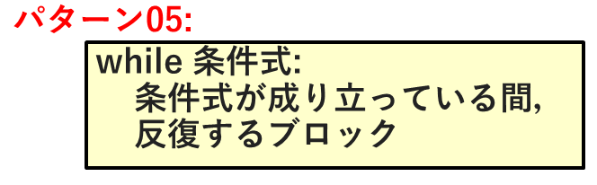
-->


  * 以下のfor文と同様の挙動を，while文で書いてみましょう

<!--
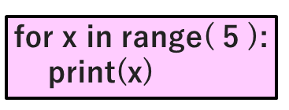
-->


<!--
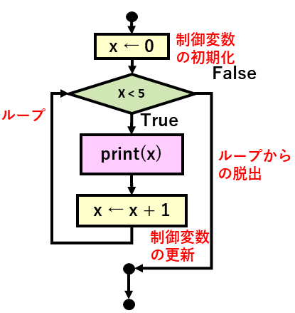
-->


#### 例題(Example)-09: [while文]  0～4までのループ回数を，順に表示する

  * 0～4までのループ回数を，順に表示する


```python
# ===== [例題-09: while文] 0～4までのループ回数を，順に表示する =====
# * 0～4までのループ回数を，順に表示する

x = 0
while x < 5:
    print( x )
    x += 1  
```

### Ex_10: whileループ (while_loop)

<!--
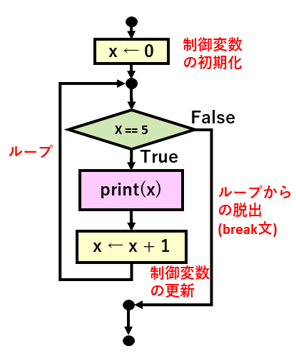
-->


#### 例題(Example)-10: [while文/break文]  0～4までのループ回数を，順に表示する

  * 0～4までのループ回数を，順に表示する
    * 制御変数を増やしていく無限ループから，
      * 制御変数が5になったときに脱出する
  * <span style="color: red; ">無限ループ</span>を作るには，while文の条件式をTrueにすればよい


```python
# ===== [例題-10: while文]  =====
# * 0～4までのループ回数を，順に表示する
#   * 制御変数を増やしていく無限ループから，
#     * 制御変数が5になったときに脱出する
# * 無限ループを作るには，while文の条件式をTrueにすればよい

x = 0
while True:
    if x == 5:
        break
    print( x )
    x += 1
```

#### 練習問題(Practice)-05: [while文] 二乗したときに50未満となるような整数列

  * 0から始めて，二乗したときに50未満である間，整数を表示する
  * <span style="color: red; ">線形探索パターン</span>
    * 二乗したときに50未満になる最大の整数を探索することにも相当する
  * <span style="color: red; ">for文とwhile文の使い分け</span>
    * for文を使うとき
      * 基本的にループの回数や，制御変数の変化する系列が事前にわかっているとき
    * while文を使うとき
      * ループを実行してみないと，ループ回数などが事前にわからないときなど
      * もちろん，この練習問題に限って言えば
        * 平方根を計算し，小数点以下を切り捨てることで，ループ回数は事前にわかりますが...


```python
# ===== [練習問題-05: while文] 二乗したときに50未満となるような整数列 =====
# * 0から始めて，二乗したときに50未満である間，整数を表示する
# * 線形探索パターン
#   * 二乗したときに50未満になる最大の整数を探索することにも相当する

x = 0
while ★★★穴埋め★★★:
    print( x, x ** 2 )
    x += 1
```

----
### [2] 復習: 入出力 (I/O; input/output) → パターン-06
(<a href="#目次"> 目次に戻る </a>)

<!--
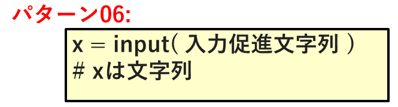
-->


### [2-a] input関数
(<a href="#目次"> 目次に戻る </a>)

### Ex_11: input関数 / print関数

   * <span style="color: red; ">標準入出力</span> (ターミナル・ウィンドウ / Windowsならコマンド・プロンプト)
     * 標準入力 (キーボード入力)
       * <span style="color: red; ">input関数</span>
     * 標準出力 (コンソール出力 / 画面出力)
       * <span style="color: red; ">print関数</span>

#### 例題(Example)-11: [input関数]   基本的な使い方

  * 標準入力 (キーボード入力)から，文字列を受け取ります
    * input関数の引数は，入力を促すために，表示される文字列です
      * プロンプト・メッセージないし入力促進文字列と言います
    * input関数の返戻値(返す値)は，入力された文字列です


```python
# ===== 例題(Example)-11: [input関数] 基本的な使い方 ====
# * input関数の基本的な使い方
#   * 標準入力 (キーボード入力)から，文字列を受け取る

x = input( "何か文字列を入力してください: " )
print( "入力されたのは" + x )
```

### Ex_12: input関数 / print関数

#### 例題(Example)-12: [input関数/for文]  ループの回数をキーボードから入力する

  * input関数の返戻値は文字列(str)なので
    * 数値として利用するには，整数(int)へ変換する必要があります
      * int( 文字列 )で変換します


```python
# ===== [例題-12: [input関数/for文] ループの回数をキーボードから入力する ====
# * input関数の返戻値は文字列(str)なので
#   * 数値として利用するには，整数(int)へ変換する必要がある
#     * int( 文字列 )で変換する

x = input( "1桁の整数を入力してください: " )
for y in range( int( x ) ):
    print( y )
```

#### 練習問題(Practice)-06: [input関数/while文] 必要な個数の正整数データを入力する

  * 正の整数の入力を繰り返して，表示する
    * 正の整数以外のものが入力されたら，エラー表示する
    * exitもしくはquitが入力されたら，ループを終了する
    * 事前にデータ数がわからないときは，
      * for文ではなく，while文がふさわしい


```python
# ===== [練習問題-06: input関数/while文] 必要な個数の正整数データを入力する ====
# * 正の整数の入力を繰り返して，表示する
#   * 正の整数以外のものが入力されたら，エラー表示する
#   * exitもしくはquitが入力されたら，ループを終了する
#   * 事前にデータ数がわからないときは，
#     * for文ではなく，while文がふさわしい

print( "正の整数を繰り返し入力してください" )
print( "　　exitもしくはquitが入力されたら，ループを終了する" )

while ★★★穴埋め★★★:
    x_str = input( "正の整数> " )
    if x_str == "exit" or x_str == "quit":
        print( "ループを終了する" )
        ★★★穴埋め★★★
    if ★★★穴埋め★★★:
        x_int = int( x_str )
        print( f"入力された{ x_int }" )
    else:
        print( "入力エラー: 正の整数ではない" )
```

----
### [3] 復習: データ構造 (data structure) / コンテナ(container)
(<a href="#目次"> 目次に戻る </a>)

----
### [3-a] リストの要素の列挙 (list_enumeration)→ パターン-07
(<a href="#目次"> 目次に戻る </a>)

  * 各括弧の間に，<span style="color: red; ">要素</span>を，カンマで区切って並べる
    * (例) [ 1, 2, 3 ]  や [ "a", "b", "c" ]
    * 要素のデータ型(タイプ)は，異なっていてもよい
      * (例) [ 1, "b", 3 ] 
    * リストを要素とするリストもかまわない
      * (例) [ [ 1, 2 ], [ 1, 2, [ 3, 4 ], 5 ]

<!--
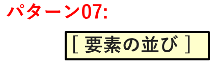
-->


### Ex_13: リストの要素の列挙 (list_enumeration)

#### 例題(Example)-13: [リスト] リストの要素を順に表示する

#### 例題(Example)-13: [リスト] リストの要素</span>を順に表示する

  * リスト[ "a", "b", "c" ]の要素を順に表示する

<!--
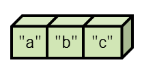
-->


```python
# ===== [例題-13: リスト]  リストの要素を順に表示する =====
#  * リスト[ "a", "b", "c" ]の要素を順に表示する

for x in [ "a", "b", "c" ]:
    print( x )
```

### Ex_14: リストの要素の列挙 (list_enumeration) 

#### 例題(Example)-14: [リスト] 整数リストの要素の総和を求める  

#### 例題(Example)-14: [リスト] 整数リストの要素の総和を求める  

  * [ 1, 2, 3, 4, 5 ]の総和を求める

<!--
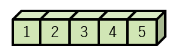
-->


```python
# ===== [例題-14: リスト]  整数リストの要素の総和を求める =====
#  * [ 1, 2, 3, 4, 5 ]の総和を求める

sum = 0
for x in [ 1, 2, 3, 4, 5 ]:
    sum += x
print( sum )
```

----
### [3-b] リストの内包表記 (list_comprehension)→ パターン-08
(<a href="#目次"> 目次に戻る </a>)

<!--
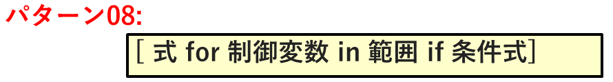
-->


  * <span style="color: red; ">〈範囲〉</span>の各要素のうち，<span style="color: red; ">〈条件式〉</span>が成り立つものを順次，<span style="color: red; ">〈制御変数〉</span>に代入し，<span style="color: red; ">〈式〉</span>での計算結果を列挙したリスト

### Ex_15: リストの内包表記 (list_comprehension)

#### 例題(Example)-15: [リストの内包表記 ] 0～9まで整数の二乗から成るリストを生成する

  * 内包定義でリストを生成する

<!--
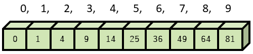
-->


  * 0～9までの〈範囲〉の整数を，それぞれ二乗して作られるリスト


```python
# ===== [例題-15: リスト]  0～9まで整数の二乗から成るリストを生成する =====
#  * 内包表記でリストを生成する

print( [ x ** 2 for x in range( 10 ) ] )
```

### Ex_16: リストの内包表記  (list_comprehension)

#### 例題(Example)-16: [リストの内包表記 ] 0～9までの〈範囲〉の中の奇数だけを列挙したリストを生成する

  * 内包表記でリストを生成する

<!--
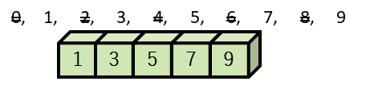
-->


  * 0～9までの〈範囲〉の中の奇数だけを列挙したリスト


```python
# ===== [例題-16: リスト]  0～9までの〈範囲〉の中の奇数だけを列挙したリストを生成する =====
#  * 内包表記でリストを生成する

print( [ x for x in range( 10 ) if x % 2 == 1] )
```

#### 練習問題(Practice)-07: [リストの内包表記]  2次元の表: 「九九の表」

  * <span style="color: red; ">「各行を意味するリストの，リスト」</span>で，
    * <span style="color: red; ">2次元の表</span>ないし<span style="color: red; ">行列(Matrix)</span>を表現できます
    * それを作るには，<span style="color: red; ">リストの内包表記を2重に使う</span>こともできます


  * Pythonでは，他言語で書かれたライブラリを使うことで，高速化を図ることがよくあります
    * Pythonよく使われるモジュール
      * Numpyパッケージ
        * Vector, Matrix, Tensorなどを扱うのに，C言語で作られて実行速度が速いNumpyのArrayをよく使います
      * Pandasパッケージ
        * 大規模な表を扱うには，PandasのDataFrameをよく使います
      * HDF5パッケージ
        * 比較的最近では，階層的な表データを扱うのにHDF5もよくつかわれています
    * 基本的なPythonの言語処理系は，実行速度が遅い部類に属します
      * 遅い原因は，インタープリタ方式（逐次実行方式）だからです
        * 通訳方式といってもよいでしょう．
          * 典型的には，プログラムのソースコートを1行ずつ実行時に解析しながら実行します
        * 実行前に，プログラムを


```python
# ===== [練習問題-07: リストの内包表記] 2次元の表: 「九九の表」 =====
#  * 「各行を意味するリストの，リスト」で，
#   * 2次元の表ないし行列(Matrix)を表現できます
#   * それを作るには，リストの内包表記を2重に使うこともできます

table_kuku = ★★★穴埋め★★★

print( table_kuku )

# ----- おまけ: pprintモジュールのpprint()関数を使うと，
# -----         少しだけ，読みやすく整形して表示してくれます
#  * pprintという名称は，pretty printに由来します

print() # 1行空けるだけ

import pprint
pprint.pprint( table_kuku )
```

----
### [4] 復習: 関数 (function)→ パターン-09/10
(<a href="#目次"> 目次に戻る </a>)

#### 関数定義

<!--
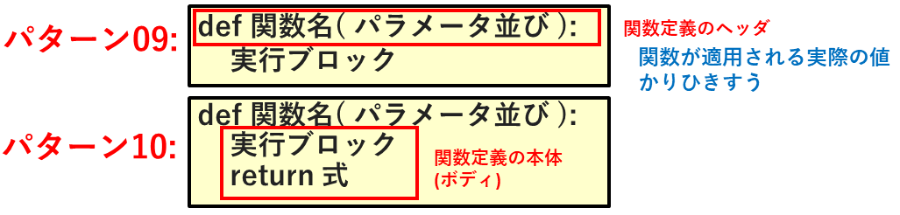
-->


<!--
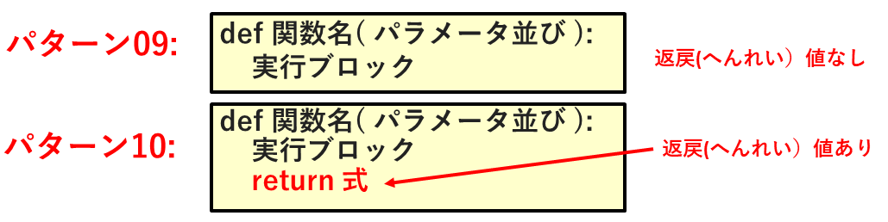
-->


#### 関数: 前提としてのスキル(入門レベル)

  * 「関数」に関して，<span style="color: red; ">前提としてのスキルセット</span>と，<span style="color: red; ">この授業で更に追加されるスキルセット</span>がある
    * 「関数」に関連する概念は奥が深い
    * とりあえずは，入門レベルのスキルセットのみが前提
      * とうことで，「復習」の範囲は...
        * 関数の概念，関数の基本的な定義方法，関数の基本的な利用方法
        * 引数の概念(いわゆる位置パラメータの範囲のみ)
        * 返戻値(リターン値)の概念

#### [用語] 関数名: 前提としてのスキル(入門レベル) 

  * <span style="color: red; ">関数名</span>
    * 英字で始まる英数字が推奨されている
      * 英字は小文字のみを使い，複合語の場合，アンダースコア( \_ )で区切るのが推奨されている
        * 文字コードがUTF-8(ユニコード)を前提としているので，漢字なども使えるが，非推奨
          * 我々には，わかりやすいけど，漢字圏でない国が多いので奨められない

#### [用語] 引数: 前提としてのスキル(入門レベル) 

  * <span style="color: red; ">引数</span>
    * 「ひきすう」と読む(「いんすう」とは読まない)
      * 「ひきすう」という言葉は，最初のうちは聞き慣れていないかもしれませんが，割とすぐに馴染むようです．
  * <span style="color: red; ">仮引数(formal parameter)</span>
    * 関数定義中で，定義本体部で計算を表現するために，定義頭部で導入される変数名
      * ここでのformalの意味は...
        * 「公式的」，「儀礼的」，「堅苦しい」という意味ではない
        * 「数学的」とか，「論理的」という意味でもない
        * 単に，関数を定義するための「名目的に」「うわべ上」のものといった感じ
    * 単にパラメータ(parameter)というと，仮引数を指すことが一般的
      * この授業でも，混同しない範囲で，そのように使います．
  * <span style="color: red; ">実引数(argument)</span>
    * 関数の呼び出し時に，関数へ引き渡される「実際の」値
      * 「実」の部分を強調するときには，actual argumentと呼ぶが...
        * actualを省くことが多く，単に，アーギュメント(argument)というと，実引数を指すことが一般的
        * もっとも，formalとactualの対比で，actual parameterという呼び方もある
    * アーギュメントという言葉は，日本語では聞きなれないので，
      * 混同しない範囲で，実引数のことを指すとも，パラメータで済ませてしまうこともあります
      * 例えば，「関数fに実引数5を引き渡す」ことを，「関数fにパラメータ5を与える」と言うこともよくあります

#### [用語] 返戻値: 前提としてのスキル(入門レベル) 

  * <span style="color: red; ">返戻値</span>
    * 関数の返す値のこと
    * 「へんれいち」と読む
      * 返戻値という言葉は聞き慣れないかもしれませんね
        * 文字で書くときは短くてよいけれど，
        * 口で言うときは，リターン・バリューといった方がよく伝わります．

#### [用語] 関数の副作用: 前提としてのスキル(入門レベル) 

  * 関数の<span style="color: red; ">副作用(side-effect)</span>
    * 関数は，計算して，返戻値を返すだけでなく，外部に影響を及ぼすこともあります
      * 詳しいことは，復習の一環として，追々取りあげますが，
        * <span style="color: red; ">グローバル変数(大域変数)</span>
          * 関数定義の外側(<span style="color: red; ">グローバルスコープ</span>)で初期化された変数
          * グローバル変数の値を，global宣言をしたうえで，変更することもあります
          * グローバル変数の値は，global宣言がなくても，参照はできます
        * <span style="color: red; ">ローカル変数(局所変数)</span>
          * 関数定義の内側(<span style="color: red; ">関数スコープ</span>)で初期化された変数
            * 関数定義の外側では使えない
            * グローバル変数と同じ名前でローカル変数を初期化した
      * 画面表示や，ファイルへの出力もありえます
        * これらも関数の副作用に含まれます
    * 副作用の方を主体とする場合もあります
      * その場合，<span style="color: red; ">手続き(procedure)</span>と呼び，定義方法を替えるプログラミング言語もありますが
        * Pythonでは，あえて区別していません．
      * 一方で，副作用を持たない関数を，<span style="color: red; ">純粋(pure)な関数(function)</span>と呼ぶこともあります．

#### 関数: 前提としてのスキル(入門レベル)

  * 「関数」の理解
    * 関数という「計算装置」が，「入力として引数を受け取り（引き渡されて），計算作業をして，返戻値を返す」という理解の仕方が一般的かもしれません．
      * 一般的なfunctionの意味は，元々，「機能」とか「作用」ですから，特定の機能を備えた装置と考えるのはわかりやすいでしょう
      * 特に「副作用」を考慮すると，この理解の仕方はピンときます
    * ですが，特に「副作用」を含まず，返戻値のみ期待する，純粋(pure)な関数の場合では，以下のように理解されることもあります
      * 実引数へ関数を適用する(function application)と，返戻値に置き換えられる
      * 数学でいう「写像(mapping)」という意味では，わかりやすいかもしれませんが，副作用の存在が抜け落ちてしまいますね

#### 関数: この授業の中で補われるスキル(入門レベル→初級レベル)

  * この授業初級レベルのスキルセットとして，この授業で更に追加される(予定)のもの
    * <span style="color: red; ">キーワード引数(keyword parameter)，デフォールト値，
    * <span style="color: red; ">可変長引数
      * 辞書やタプルを取り上げた後で，取り上げます
    * <span style="color: red; ">高階関数(higher-order function)
      * 関数を引数として渡したり，返戻値として返したりする関数
      * Pythonでは，関数を，一種の「値」(第一級(first-class)オブジェクトと言います)として扱えるので，
        こうした関数が定義・利用できます．
    * <span style="color: red; ">関数閉包(closure)
      * 変数のスコープ(有効範囲)について復習し，高階関数について取り上げた後で，取り上げます

### Ex_17: 関数 (function)

#### 関数定義 (function definition)

  * <span style="color: red; ">関数定義</span>
    * <span style="color: red; ">ヘッダ (定義頭部)</span>
      * defで始まり，〈関数名〉と，括弧で囲まれカンマ(,)で区切られた〈仮引数の並び〉と，コロン(:)が続く
    * <span style="color: red; ">ボディ (定義本体)</span>
      * 返戻値があるときは，<span style="color: red; ">return文</span>で指定する
        * returnは，〈文〉であり〈関数〉ではないので，直後の括弧は必要ないが，
        * 私はあえてつけることが多い
          * 但し，タプル(今回は説明しない)を形成する括弧と混同しないように注意

#### 例題(Example)-17: [関数] 整数の偶奇判定する関数

  * 整数の偶奇判定する関数を定義する
    * 結果は，文字列で返す

<!--
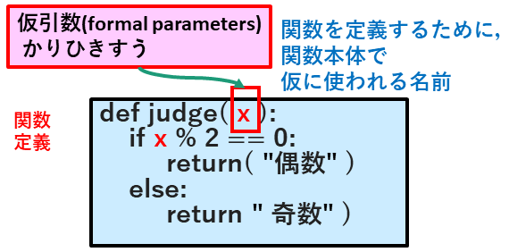
-->


```python
# ===== [例題-17-a: 関数] 整数の偶奇判定する関数を定義する =====
#  * 整数の偶奇判定する関数を定義する
#    * 結果は，文字列で返す

def judge( x ):
    if x % 2 == 0:
         return( "偶数" )
    else:
         return( "奇数" )
```

#### 関数適用 (function application) / 関数呼び出し (function invocation)

<!--
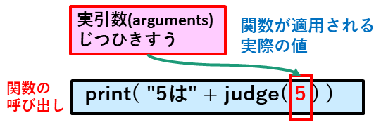
-->


```python
# ===== [例題-17-b: 関数] 整数の偶奇判定する関数を利用する =====
#  * 整数の偶奇判定する関数を利用する
#    * 結果は，文字列で返される

print( "5は" + judge( 5 ))
```


```python
# ===== [例題-17-b: 関数] 整数の偶奇判定する関数を利用する =====
#  * 整数の偶奇判定する関数を利用する
#    * 結果は，文字列で返される

for x in range( 7 ):
    print( str( x ) + "は" + judge( x ) )
```

### Ex_18: 関数 (function)

#### 関数定義 (function definition)

#### 例題(Example)-18: [関数] 偶数か否かを判定する関数を定義する

  * 偶数か否かを判定する関数を定義する
    * 結果はTrue/Falseで返す


```python
# ===== [例題-18-a: 関数] 偶数か否かを判定する関数を定義する =====
#  * 偶数か否かを判定する関数を定義する
#    * 結果はTrue/Falseで返す

def is_even( x ):
    return x % 2 == 0
```

#### 関数適用 (function application) / 関数呼び出し (function invocation)


```python
# ===== [例題-18-b: 関数] 偶数か否かを判定する関数を利用する =====
#  * 偶数か否かを判定する関数を利用する
#    * 結果はTrue/Falseで返される


for x in range( 7 ):
    if is_even( x ):
         print( str( x ) + "は偶数" )
    else:
         print( str( x ) + "は奇数" )
```

#### 練習問題(Practice)-08-a: [関数]  倍数か否かを判定する関数multiply_by( x, m )を定義する

  * 引数xが，引数mの倍数か否かを判定する関数multiply_by( x, m )を定義する


```python
# ===== [練習問題-08-a: 関数] 倍数か否かを判定する関数を定義する =====
#  * 引数xが，引数mの倍数か否かを判定する関数multiply_by( x, m )を定義する

def multiply_by( x, m ):
    return( ★★★穴埋め★★★ )

# ===== [テスト] =====
print( f"15は3の倍数か? { multiply_by( 15, 3 ) }" )
print( f"15は5の倍数か? { multiply_by( 15, 5 ) }" )
print( f"11は5の倍数か? { multiply_by( 11, 5 ) }" )
```

#### 練習問題(Practice)-08-b: [関数]  倍数か否かを判定する関数multiply_by( x, m )を利用する

  * キーボードから，正の整数を読み込み，以下の判定を繰り返して，結果を表示します
    * 3の倍数か
    * 5の倍数か
    * どちらでもないか
  * 正の整数の代わりに，exitもしくはquitと入力すると，ループを終了します


```python
# ===== [練習問題-08-b: 関数] 倍数か否かを判定する関数を利用する =====
#  * 引数xが，引数mの倍数か否かを判定する関数multiply_by( x, m )を利用する
#   * キーボードから，正の整数を読み込み，以下の判定を繰り返して，結果を表示する
#    * 3の倍数か
#    * 5の倍数か
#    * どちらでもないか
#  * 正の整数の代わりに，exitもしくはquitと入力すると，
#    * ループを終了する

print( "入力された正の整数が，3の倍数か5の倍数か，" )
print( "　　　そのどちらでもないか，を判定します" )
print( "  * 正の整数を繰り返し入力してください" )
print( "  * exitもしくはquitが入力されたら，ループを終了する" )

while True:
    x_str = input( "正の整数> " )
    if x_str == "exit" or x_str == "quit":
        print( "ループを終了する" )
        break
    if x_str.isnumeric():
        x_int = int( x_str )
        if ★★★穴埋め★★★:
            print( f"{x_int}は，3の倍数です" )
        if ★★★穴埋め★★★:
            print( f"{x_int}は，5の倍数です" )
        if ★★★穴埋め★★★:
            print( f"{x_int}は，3の倍数でも5の倍数もありません" )
    else:
        print( "入力エラー: 正の整数ではない" )
```

#### 練習問題(Practice)-09-a: [関数] fizz/buzz文字列を返す関数を定義する

  * 以下の関数を定義する
    * 関数fizzbuss_str( x ): 
      * 与えられた正の整数xに対し，fizz/buzz文字列を返す
    * 練習問題-09で定義した関数multiply_by( x, m )を利用してください
  * fizz/buzz文字列とは，以下のように定義します
    * xが3の倍数であり，かつ5の倍数でないなら，"fizz"
    * xが5の倍数であり，かつ3の倍数でないなら，"buzz"
    * xが3の倍数であり，かつ5の倍数であるなら，"fizzbuzz"
    * いずれでもなければ，その正整数そのもの


```python
# ===== [練習問題-09-a: 関数定義] 関数を定義する =====
#  * fizz/buzz文字列を返す関数を定義する
#   * 関数fizzbuss_str( x ): 
#     * 与えられた正の整数xに対し，fizz/buzz文字列を返す
#   * 練習問題-09で定義した関数multiply_by( x, m )を利用してください
# * fizz/buzz文字列とは，以下のように定義します
#   * xが3の倍数であり，かつ5の倍数でないなら，"fizz"
#   * xが5の倍数であり，かつ3の倍数でないなら，"buzz"
#   * xが3の倍数であり，かつ5の倍数であるなら，"fizzbuzz"
#   * いずれでもなければ，その正整数そのもの

def fizzbuss_str( x ):
    if ★★★穴埋め★★★:
        # 3と5の最小公倍数である15の倍数判定でも同等
        return( "fizzbuzz" )
    elif ★★★穴埋め★★★:
        return( "fizz" )
    elif ★★★穴埋め★★★:
        return( "buzz" )
    else:
        return( str( x ) )

# ===== [テスト] =====
print( f"30のfizz/buzz文字列は: { fizzbuss_str( 30 ) }" )
print( f"20のfizz/buzz文字列は: { fizzbuss_str( 20 ) }" )
print( f"18のfizz/buzz文字列は: { fizzbuss_str( 18 ) }" )
```

#### 練習問題(Practice)-09-b: [関数] fizzbuss_str()関数を利用する

  * キーボードから，正の整数を読み込み，そのfizz/buzz文字列を表示することを繰り返します
    * fizzbuss_str()関数を使って下さい
  * 正の整数の代わりに，exitもしくはquitと入力すると，ループを終了します


```python
# ===== [練習問題-09-b: 関数] 関数を利用する =====
#  * 引数xが，引数mの倍数か否かを判定する関数multiply_by( x, m )を利用する
#   * キーボードから，正の整数を読み込み，対応するfizz/buzz文字列を表示する
#  * 正の整数の代わりに，exitもしくはquitと入力すると，
#    * ループを終了する

print( "入力された正の整数に対応するfizz/buzz文字列を表示する" )
print( "  * 正の整数を繰り返し入力してください" )
print( "  * exitもしくはquitが入力されたら，ループを終了する" )

while True:
    x_str = input( "正の整数> " )
    if x_str == "exit" or x_str == "quit":
        print( "ループを終了する" )
        break
    if x_str.isnumeric():
        x_int = int( x_str )
        print( ★★★穴埋め★★★ )
    else:
        print( "入力エラー: 正の整数ではない" )


```

## [5] まとめ
(<a href="#目次"> 目次に戻る </a>)

### [5-a] 復習の内容
(<a href="#目次"> 目次に戻る </a>)

  * ソフトウェア工学-(Software-Engineering)
    * 第01回-a: 復習 (Review)

      * [0] はじめに
      * [1] 復習: 制御構造(Control_Structure)
        * [1-a] 条件分岐 (if文)
        * [1-b] 反復/ループ (for文)
        * [1-c] 反復/ループ (while文)
      * [2] 復習: 入出力 (I/O; input/output) → パターン-06
        * [2-a] 
      * [3] 復習: データ構造 (data structure) / コンテナ(container)
        * [3-a] リストの要素の列挙 (list_enumeration)→ パターン-07
        * [3-b] リストの内包表記 (list_comprehension)→ パターン-08
      * [4] 復習: 関数 (function)→ パターン-09/10

### [5-b] 例題一覧
(<a href="#目次"> 目次に戻る </a>)

 |例題-ID|テーマ         |概要                                                      |
 |:------|:--------------|:---------------------------------------------------------|
 |例題-01|if文           |整数の大小比較                                            |
 |例題-02|if-else文      |変数xに代入した整数の偶奇判定                             |
 |例題-03|if-elif-else文 |現在(プログラム実行時)の時刻に適した挨拶を表示する        |
 |例題-04|for文          |0～4までの偶数                                            |
 |例題-05|for文/break文  |0～4までループする中で，3が出現したら中断する             |
 |例題-06|for文          |0～9までの総和を計算し，表示する                          |
 |例題-07|for文          |0～20までの中で，3の倍数と5の倍数のそれぞれの個数を数える |
 |例題-08|for文          |文字列中の各文字を，順に一行ずつ表示する                  |
 |例題-09|while文        |0～4までのループ回数を，順に表示する                      |
 |例題-10|while文/break文|0～4までのループ回数を，順に表示する                      |
 |例題-11|input関数      |基本的な使い方                                            |
 |例題-12|input関数/for文|ループの回数をキーボードから入力する                      |
 |例題-13|リスト         |リストの要素を順に表示する                                |
 |例題-14|リスト         |整数リストの要素の総和を求める                            |
 |例題-15|リスト内包定義 |0～9まで整数の二乗から成るリストを生成する                |
 |例題-16|リスト内包定義 |0～9までの〈範囲〉の中の奇数だけを列挙したリストを生成する|
 |例題-17|関数           |整数の偶奇判定する関数                                    |
 |例題-18|関数           |偶数か否かを判定する関数                                  |


### [5-c] 練習問題一覧
(<a href="#目次"> 目次に戻る </a>)

 |練習問題-ID|テーマ           |概要                                                |
 |:----------|:----------------|:---------------------------------------------------|
 |練習問題-01|if-else文        |3の倍数判定                                         |
 |練習問題-02|if-elif-else文   |fizz/buzz判定                                       |
 |練習問題-02|for文            |0～10までの3の倍数                                  |
 |練習問題-03|for文            |二重ループ: 「九九の表」を表示する                  |
 |練習問題-04|for文            |文字列中の数字の総和(左から数字以外の文字が出るまで)|
 |練習問題-05|while文          |二乗したときに50未満となるような整数列              |
 |練習問題-06|input関数/while文|必要な個数の正整数データを入力する                  |
 |練習問題-07|リスト内包表記   |2次元の表: 「九九の表」                             |
 |練習問題-08|関数             |倍数か否かを判定する関数multiply_by( x, m )         |
 |練習問題-09|関数             |fizz/buzz文字列を返す関数                           |


